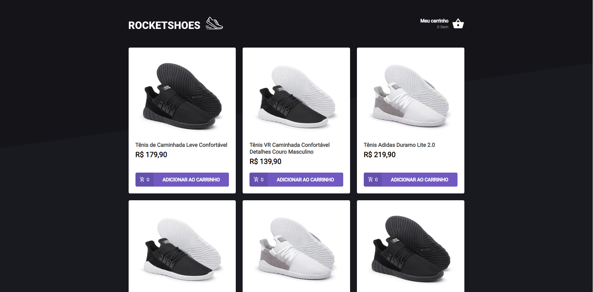
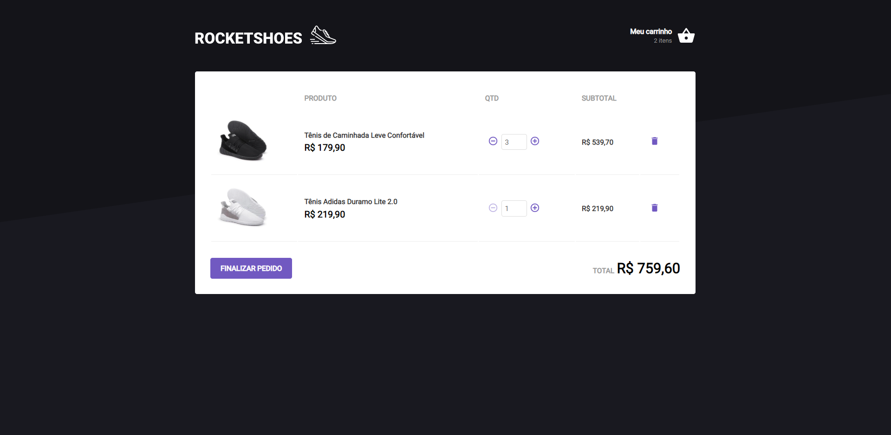
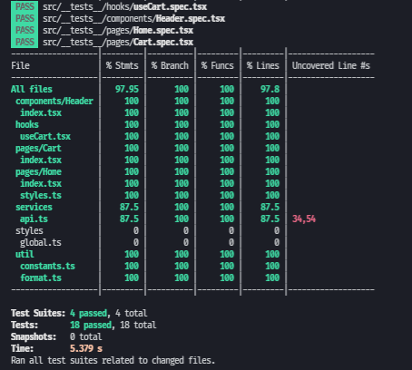

# RocketShoes - ignite

## Available Scripts

In the project directory, you can run:

### `yarn`

To install dependencies.

### `yarn start`

Runs the app in the development mode.\
Open [http://localhost:3000](http://localhost:3000) to view it in the browser.

### `yarn server`

Runs the json-server in port 3333.\
Open [http://localhost:3333](http://localhost:3333) to view it in the browser.

### `yarn test`

Launches the test runner in the interactive watch mode.\
See the section about [running tests](https://facebook.github.io/create-react-app/docs/running-tests) for more information.

## Prints

`Dashboard`

`Carrinho de compras`

`Coverage`

